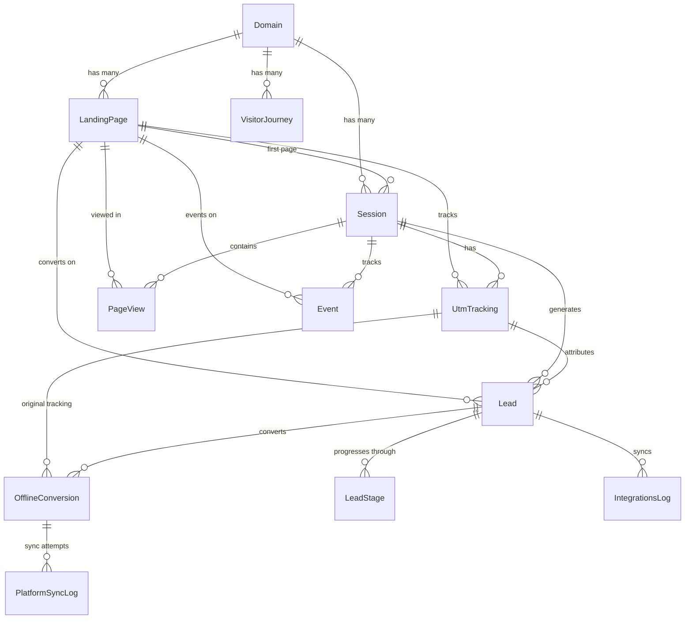

# Guia de Relacionamentos entre Entidades - Sistema de Tracking UTM

## 📋 Índice
1. [Visão Geral](#visão-geral)
2. [Diagrama de Relacionamentos](#diagrama-de-relacionamentos)
3. [Entidades Principais](#entidades-principais)
4. [Guia de Uso por Cenário](#guia-de-uso-por-cenário)
5. [Melhores Práticas](#melhores-práticas)
6. [Queries de Exemplo](#queries-de-exemplo)

## 🔍 Visão Geral

Este sistema de tracking UTM foi projetado para rastrear a jornada completa do visitante, desde o primeiro clique até a conversão offline. As 12 entidades trabalham em conjunto para fornecer uma visão 360° do comportamento do usuário e performance de campanhas.

### Fluxo Principal de Dados

```
Visitante → Domain → LandingPage → Session → UTM Tracking
                                      ↓
                                  PageViews
                                  Events
                                      ↓
                                    Lead
                                      ↓
                                 LeadStage
                                      ↓
                              OfflineConversion
                                      ↓
                              PlatformSyncLog
```

## 📊 Diagrama de Relacionamentos



## 📦 Entidades Principais

### 1. **Domain** (`domains`)
**Propósito**: Representa os domínios/sites monitorados pelo sistema.

**Campos importantes**:
- `domain_id`: Identificador único
- `domain_name`: Nome amigável do domínio
- `domain_url`: URL completa
- `metadata`: Configurações específicas (tipo `DomainMetadata`)

**Como usar**:
```typescript
// Buscar todas as landing pages de um domínio
const domain = await domainRepository.findOne({
  where: { domain_name: 'meusite.com' },
  relations: ['landing_pages']
});

// Configurar metadata do domínio
domain.metadata = {
  analytics: {
    googleAnalyticsId: 'GA-123456',
    facebookPixelId: '987654321'
  },
  settings: {
    timezone: 'America/Sao_Paulo',
    language: 'pt-BR'
  }
};
```

### 2. **LandingPage** (`landing_pages`)
**Propósito**: Gerencia páginas específicas dentro de um domínio, incluindo variantes A/B.

**Campos importantes**:
- `page_variant`: Identificador da variante (A, B, etc.)
- `is_control`: Se é a versão controle
- `ab_test_id`: Agrupa variantes do mesmo teste

**Como usar**:
```typescript
// Criar teste A/B
const pageA = await landingPageRepository.save({
  domain_id: domainId,
  page_url: '/produto/oferta-especial',
  page_name: 'Oferta Especial - Controle',
  page_variant: 'A',
  is_control: true,
  ab_test_id: generateUUID()
});

const pageB = await landingPageRepository.save({
  ...pageA,
  page_id: undefined,
  page_name: 'Oferta Especial - Variante B',
  page_variant: 'B',
  is_control: false
});
```

### 3. **Session** (`sessions`)
**Propósito**: Rastreia uma visita completa do usuário ao site.

**Campos importantes**:
- `session_id`: ID gerado pelo frontend
- `visitor_id`: Hash(IP + UserAgent + Domain) para identificar visitantes únicos
- `converted`: Indica se houve conversão nesta sessão

**Como usar**:
```typescript
// Atualizar métricas da sessão
await sessionRepository.update(sessionId, {
  total_page_views: () => 'total_page_views + 1',
  last_activity_at: new Date(),
  converted: true
});

// Buscar sessões convertidas
const convertedSessions = await sessionRepository.find({
  where: { 
    converted: true,
    domain_id: domainId,
    started_at: MoreThan(new Date('2024-01-01'))
  },
  relations: ['leads', 'utm_trackings']
});
```

### 4. **UtmTracking** (`utm_tracking`)
**Propósito**: Armazena parâmetros UTM e IDs de cliques das plataformas.

**Campos importantes**:
- UTM padrão: `utm_source`, `utm_medium`, `utm_campaign`, etc.
- IDs de plataforma: `gclid` (Google), `fbclid` (Facebook), `ttclid` (TikTok), `li_fat_id` (LinkedIn)
- `url_params`: JSONB para parâmetros customizados

**Como usar**:
```typescript
// Registrar novo tracking
const tracking = await utmTrackingRepository.save({
  session_id: sessionId,
  page_id: pageId,
  utm_source: 'google',
  utm_medium: 'cpc',
  utm_campaign: 'black_friday_2024',
  gclid: 'Cj0KCQiA...',
  device: detectDevice(userAgent),
  client_ip: request.ip,
  url_params: {
    custom_param: 'value',
    ab_test: 'variant_b'
  }
});

// Buscar por campanha
const campaignData = await utmTrackingRepository.find({
  where: { utm_campaign: 'black_friday_2024' },
  relations: ['leads', 'offline_conversions']
});
```

### 5. **Lead** (`leads`)
**Propósito**: Armazena informações de contatos que preencheram formulários.

**Campos importantes**:
- `hashed_email` / `hashed_phone`: Versões hash SHA256 para privacidade
- `lead_score`: Pontuação de qualificação
- `is_business_email`: Identificação automática de emails corporativos
- `time_to_conversion`: Tempo desde a primeira visita até conversão
- `metadata`: Dados adicionais (tipo `LeadMetadata`)

**Como usar**:
```typescript
// Criar lead com enriquecimento
const lead = await leadRepository.save({
  session_id: sessionId,
  utm_tracking_id: trackingId,
  page_id: pageId,
  name: 'João Silva',
  email: 'joao@empresa.com',
  hashed_email: sha256('joao@empresa.com'),
  company: 'Empresa XYZ',
  phone: '11999999999',
  hashed_phone: sha256('11999999999'),
  is_business_email: true,
  email_domain: 'empresa.com',
  lead_score: 'A',
  time_to_conversion: calculateTimeToConversion(session),
  metadata: {
    scoring: {
      demographic: 80,
      behavioral: 90,
      firmographic: 85,
      total: 85
    },
    qualification: {
      budget: 'high',
      authority: 'decision_maker',
      need: 'urgent',
      timeline: '0-3months'
    },
    enrichment: {
      companySize: '50-200',
      industry: 'Tecnologia',
      revenue: '$1M-$10M',
      technologies: ['Salesforce', 'HubSpot', 'AWS']
    }
  }
});
```

### 6. **LeadStage** (`lead_stages`)
**Propósito**: Rastreia a progressão do lead no funil de vendas.

**Estágios típicos**:
- `new`: Novo lead
- `qualified`: Lead qualificado (SQL)
- `proposal`: Proposta enviada
- `negotiation`: Em negociação
- `won`: Venda fechada
- `lost`: Perdido

**Como usar**:
```typescript
// Registrar mudança de estágio
await leadStageRepository.save({
  lead_id: leadId,
  stage_name: 'qualified',
  stage_value: 50000, // R$ 50.000
  probability: 30, // 30% de chance
  changed_by: 'vendedor@empresa.com',
  reason: 'Lead demonstrou interesse e tem orçamento aprovado'
});

// Buscar histórico do lead
const history = await leadStageRepository.find({
  where: { lead_id: leadId },
  order: { created_at: 'ASC' }
});
```

### 7. **OfflineConversion** (`offline_conversions`)
**Propósito**: Registra vendas fechadas para envio às plataformas de ads.

**Campos importantes**:
- `conversion_name`: Tipo da conversão (ex: 'purchase', 'contract_signed')
- `sync_status`: Status de sincronização por plataforma
- Constraint único: `lead_id + conversion_name`

**Como usar**:
```typescript
// Registrar venda fechada
const conversion = await offlineConversionRepository.save({
  lead_id: leadId,
  original_tracking_id: lead.utm_tracking_id,
  gclid: utmTracking.gclid,
  fbclid: utmTracking.fbclid,
  conversion_value: 75000,
  conversion_currency: 'BRL',
  conversion_date: new Date(),
  conversion_name: 'purchase',
  sync_status: {
    google_ads: 'pending',
    meta: 'pending',
    linkedin: 'not_applicable'
  }
});

// Buscar conversões pendentes de sincronização
const pendingSync = await offlineConversionRepository
  .createQueryBuilder('oc')
  .where("oc.sync_status->>'google_ads' = :status", { status: 'pending' })
  .andWhere('oc.conversion_date > :date', { 
    date: new Date(Date.now() - 90 * 24 * 60 * 60 * 1000) // 90 dias
  })
  .getMany();
```

### 8. **Event** (`events`)
**Propósito**: Rastreia interações do usuário na página.

**Tipos comuns**:
- `click`: Cliques em elementos
- `scroll`: Profundidade de scroll
- `form_start`: Início de preenchimento
- `form_abandon`: Abandono de formulário
- `video_play`: Reprodução de vídeo
- `download`: Download de arquivo

**Como usar**:
```typescript
// Registrar evento
await eventRepository.save({
  session_id: sessionId,
  page_id: pageId,
  event_type: 'click',
  event_category: 'CTA',
  event_action: 'button_click',
  event_label: 'Solicitar Orçamento',
  element_id: 'cta-main',
  element_class: 'btn btn-primary',
  event_data: {
    position: 'above_fold',
    variant: 'green_button',
    text: 'Solicitar Orçamento Grátis'
  }
});
```

### 9. **PageView** (`page_views`)
**Propósito**: Rastreia a sequência de páginas visitadas.

**Como usar**:
```typescript
// Registrar visualização
const lastView = await pageViewRepository.findOne({
  where: { session_id: sessionId },
  order: { view_order: 'DESC' }
});

await pageViewRepository.save({
  session_id: sessionId,
  page_id: pageId,
  view_order: (lastView?.view_order || 0) + 1,
  time_on_page: calculateTimeOnPage(lastView),
  exit_page: false
});
```

### 10. **VisitorJourney** (`visitor_journeys`)
**Propósito**: Agrega dados de múltiplas sessões do mesmo visitante.

**Como usar**:
```typescript
// Atualizar jornada do visitante
const journey = await visitorJourneyRepository.findOne({
  where: { visitor_id: visitorId, domain_id: domainId }
});

if (journey) {
  await visitorJourneyRepository.update(journey.journey_id, {
    last_visit_at: new Date(),
    total_sessions: () => 'total_sessions + 1',
    total_page_views: () => `total_page_views + ${session.total_page_views}`,
    converted: session.converted || journey.converted,
    conversion_session_id: session.converted ? session.session_id : journey.conversion_session_id
  });
} else {
  await visitorJourneyRepository.save({
    visitor_id: visitorId,
    domain_id: domainId,
    total_sessions: 1,
    total_page_views: session.total_page_views,
    converted: session.converted,
    conversion_session_id: session.converted ? session.session_id : null
  });
}
```

### 11. **IntegrationsLog** (`integrations_log`)
**Propósito**: Registra todas as tentativas de integração com sistemas externos.

**Tipos de integração**:
- `crm`: HubSpot, Salesforce, Pipedrive
- `webhook`: Webhooks customizados
- `email`: Sistemas de email marketing
- `analytics`: Google Analytics, Mixpanel

**Como usar**:
```typescript
// Registrar tentativa de integração
const log = await integrationsLogRepository.save({
  lead_id: leadId,
  integration_type: 'crm',
  integration_name: 'hubspot',
  status: 'pending',
  request_data: {
    endpoint: '/contacts/v1/contact',
    method: 'POST',
    payload: { email: lead.email, name: lead.name }
  }
});

// Atualizar após resposta
await integrationsLogRepository.update(log.log_id, {
  status: 'success',
  response_data: {
    contactId: '12345',
    statusCode: 200
  },
  processed_at: new Date()
});

// Retry em caso de erro
await integrationsLogRepository.update(log.log_id, {
  status: 'failed',
  error_message: 'Connection timeout',
  retry_count: () => 'retry_count + 1'
});
```

### 12. **PlatformSyncLog** (`platform_sync_log`)
**Propósito**: Log detalhado de sincronizações com plataformas de ads.

**Plataformas suportadas**:
- `google_ads`: Google Ads Offline Conversions
- `meta`: Facebook/Instagram Conversions API
- `linkedin`: LinkedIn Conversions API
- `tiktok`: TikTok Events API

**Como usar**:
```typescript
// Registrar sincronização com Google Ads
await platformSyncLogRepository.save({
  conversion_id: conversionId,
  platform: 'google_ads',
  sync_status: 'success',
  request_payload: {
    gclid: conversion.gclid,
    conversion_name: 'Purchase',
    conversion_value: conversion.conversion_value,
    conversion_currency: conversion.conversion_currency,
    conversion_time: conversion.conversion_date.toISOString()
  },
  response_data: {
    result: 'SUCCESS',
    uploadId: 'abc123'
  },
  http_status_code: 200
});
```

## 🎯 Guia de Uso por Cenário

### Cenário 1: Rastreamento de Nova Visita

```typescript
// 1. Criar ou recuperar sessão
const session = await sessionRepository.save({
  session_id: generateSessionId(),
  domain_id: domain.domain_id,
  visitor_id: generateVisitorId(request),
  first_page_id: landingPage.page_id
});

// 2. Registrar UTM tracking
if (hasUtmParams(request)) {
  await utmTrackingRepository.save({
    session_id: session.session_id,
    page_id: landingPage.page_id,
    ...extractUtmParams(request),
    client_ip: request.ip,
    user_agent: request.headers['user-agent']
  });
}

// 3. Registrar page view
await pageViewRepository.save({
  session_id: session.session_id,
  page_id: landingPage.page_id,
  view_order: 1
});

// 4. Atualizar visitor journey
await updateVisitorJourney(session);
```

### Cenário 2: Conversão de Lead

```typescript
// 1. Buscar dados da sessão e UTM
const session = await sessionRepository.findOne({
  where: { session_id: formData.session_id },
  relations: ['utm_trackings']
});

// 2. Criar lead
const lead = await leadRepository.save({
  session_id: session.session_id,
  utm_tracking_id: session.utm_trackings[0]?.tracking_id,
  page_id: formData.page_id,
  ...formData.leadInfo,
  time_to_conversion: calculateTimeToConversion(session)
});

// 3. Marcar sessão como convertida
await sessionRepository.update(session.session_id, {
  converted: true
});

// 4. Criar estágio inicial
await leadStageRepository.save({
  lead_id: lead.lead_id,
  stage_name: 'new',
  changed_by: 'system'
});

// 5. Disparar integrações
await triggerIntegrations(lead);
```

### Cenário 3: Registro de Venda Offline

```typescript
// 1. Buscar lead e dados de tracking original
const lead = await leadRepository.findOne({
  where: { external_id: crmData.contactId },
  relations: ['utm_tracking']
});

// 2. Criar registro de conversão offline
const conversion = await offlineConversionRepository.save({
  lead_id: lead.lead_id,
  original_tracking_id: lead.utm_tracking_id,
  gclid: lead.utm_tracking?.gclid,
  fbclid: lead.utm_tracking?.fbclid,
  conversion_value: crmData.dealValue,
  conversion_date: crmData.closeDate,
  conversion_name: 'purchase'
});

// 3. Atualizar estágio do lead
await leadStageRepository.save({
  lead_id: lead.lead_id,
  stage_name: 'won',
  stage_value: crmData.dealValue,
  changed_by: crmData.salesRep
});

// 4. Disparar sincronização com plataformas
await syncWithAdPlatforms(conversion);
```

## 📊 Queries de Exemplo

### 1. Dashboard de Performance por Campanha

```sql
-- Performance de campanhas com conversões offline
SELECT 
  ut.utm_campaign,
  ut.utm_source,
  ut.utm_medium,
  COUNT(DISTINCT s.session_id) as total_sessions,
  COUNT(DISTINCT l.lead_id) as total_leads,
  COUNT(DISTINCT oc.conversion_id) as total_sales,
  SUM(oc.conversion_value) as total_revenue,
  AVG(l.time_to_conversion) as avg_time_to_conversion
FROM utm_tracking ut
JOIN sessions s ON ut.session_id = s.session_id
LEFT JOIN leads l ON l.utm_tracking_id = ut.tracking_id
LEFT JOIN offline_conversions oc ON oc.lead_id = l.lead_id
WHERE ut.created_at >= CURRENT_DATE - INTERVAL '30 days'
GROUP BY ut.utm_campaign, ut.utm_source, ut.utm_medium
ORDER BY total_revenue DESC;
```

### 2. Funil de Conversão por Landing Page

```sql
-- Funil completo desde a visita até venda
WITH funnel AS (
  SELECT 
    lp.page_name,
    lp.page_variant,
    COUNT(DISTINCT pv.session_id) as visitors,
    COUNT(DISTINCT CASE WHEN e.event_type = 'form_start' THEN e.session_id END) as form_starts,
    COUNT(DISTINCT l.lead_id) as leads,
    COUNT(DISTINCT CASE WHEN ls.stage_name = 'qualified' THEN ls.lead_id END) as qualified_leads,
    COUNT(DISTINCT CASE WHEN ls.stage_name = 'won' THEN ls.lead_id END) as won_deals
  FROM landing_pages lp
  JOIN page_views pv ON pv.page_id = lp.page_id
  LEFT JOIN events e ON e.page_id = lp.page_id AND e.session_id = pv.session_id
  LEFT JOIN leads l ON l.page_id = lp.page_id
  LEFT JOIN lead_stages ls ON ls.lead_id = l.lead_id
  WHERE lp.is_active = true
  GROUP BY lp.page_name, lp.page_variant
)
SELECT 
  *,
  ROUND(100.0 * form_starts / NULLIF(visitors, 0), 2) as form_start_rate,
  ROUND(100.0 * leads / NULLIF(form_starts, 0), 2) as form_completion_rate,
  ROUND(100.0 * qualified_leads / NULLIF(leads, 0), 2) as qualification_rate,
  ROUND(100.0 * won_deals / NULLIF(qualified_leads, 0), 2) as close_rate
FROM funnel
ORDER BY visitors DESC;
```

### 3. Análise de Visitantes Recorrentes

```sql
-- Comportamento de visitantes recorrentes vs novos
SELECT 
  CASE 
    WHEN vj.total_sessions = 1 THEN 'Novo'
    WHEN vj.total_sessions BETWEEN 2 AND 3 THEN 'Retornante'
    ELSE 'Frequente'
  END as visitor_type,
  COUNT(DISTINCT vj.visitor_id) as total_visitors,
  AVG(vj.total_page_views) as avg_page_views,
  SUM(CASE WHEN vj.converted THEN 1 ELSE 0 END) as total_conversions,
  ROUND(100.0 * SUM(CASE WHEN vj.converted THEN 1 ELSE 0 END) / COUNT(*), 2) as conversion_rate
FROM visitor_journeys vj
WHERE vj.domain_id = :domain_id
GROUP BY visitor_type
ORDER BY total_visitors DESC;
```

### 4. ROI por Canal com Conversões Offline

```sql
-- ROI real incluindo vendas offline
WITH channel_data AS (
  SELECT 
    COALESCE(ut.utm_source, 'direct') as channel,
    COUNT(DISTINCT ut.session_id) as sessions,
    COUNT(DISTINCT l.lead_id) as leads,
    COUNT(DISTINCT oc.conversion_id) as sales,
    COALESCE(SUM(oc.conversion_value), 0) as revenue,
    -- Assumindo custo por canal (você precisaria de uma tabela de custos real)
    CASE 
      WHEN ut.utm_source = 'google' AND ut.utm_medium = 'cpc' THEN 5000
      WHEN ut.utm_source = 'facebook' AND ut.utm_medium = 'paid' THEN 3000
      ELSE 0
    END as estimated_cost
  FROM sessions s
  LEFT JOIN utm_tracking ut ON ut.session_id = s.session_id
  LEFT JOIN leads l ON l.session_id = s.session_id
  LEFT JOIN offline_conversions oc ON oc.lead_id = l.lead_id
  WHERE s.created_at >= CURRENT_DATE - INTERVAL '30 days'
  GROUP BY channel, ut.utm_source, ut.utm_medium
)
SELECT 
  channel,
  sessions,
  leads,
  sales,
  revenue,
  estimated_cost,
  ROUND(revenue - estimated_cost, 2) as profit,
  ROUND((revenue - estimated_cost) / NULLIF(estimated_cost, 0) * 100, 2) as roi_percentage
FROM channel_data
WHERE sessions > 0
ORDER BY profit DESC;
```

## 🚀 Melhores Práticas

### 1. **Performance e Índices**
- Sempre use os índices criados nas queries
- Para queries de analytics, considere criar views materializadas
- Use paginação para grandes resultados

### 2. **Privacidade e Segurança**
- Sempre hash emails e telefones antes de armazenar
- Use os campos hashed para matching entre sistemas
- Implemente retenção de dados (ex: anonimizar após 6 meses)

### 3. **Metadata Tipada**
- Use os tipos TypeScript definidos em `metadata.ts`
- Valide metadata antes de salvar
- Mantenha estrutura consistente

### 4. **Rastreamento de Erros**
```typescript
// Padrão para registro de erros em integrações
try {
  const result = await externalAPI.call();
  await integrationsLogRepository.update(logId, {
    status: 'success',
    response_data: result,
    processed_at: new Date()
  });
} catch (error) {
  await integrationsLogRepository.update(logId, {
    status: 'failed',
    error_message: error.message,
    retry_count: () => 'retry_count + 1',
    response_data: {
      error: error.response?.data,
      statusCode: error.response?.status
    }
  });
  
  // Agendar retry se aplicável
  if (log.retry_count < 3) {
    await scheduleRetry(logId, calculateBackoff(log.retry_count));
  }
}
```

### 5. **Manutenção de Consistência**
- Use transações para operações que afetam múltiplas tabelas
- Mantenha visitor_journey sempre atualizado
- Valide unicidade de session_id antes de criar

### 6. **Otimização de Consultas**
```typescript
// ❌ Evite N+1 queries
const leads = await leadRepository.find();
for (const lead of leads) {
  const stages = await leadStageRepository.find({ where: { lead_id: lead.lead_id }});
}

// ✅ Use relations
const leads = await leadRepository.find({
  relations: ['lead_stages', 'offline_conversions', 'utm_tracking']
});

// ✅ Ou QueryBuilder para queries complexas
const leads = await leadRepository
  .createQueryBuilder('lead')
  .leftJoinAndSelect('lead.lead_stages', 'stages')
  .leftJoinAndSelect('lead.offline_conversions', 'conversions')
  .where('lead.created_at > :date', { date: lastMonth })
  .andWhere('conversions.sync_status->\'google_ads\' = :status', { status: 'success' })
  .getMany();
```

## 📝 Notas Finais

Este sistema foi projetado para ser:
- **Escalável**: Suporta particionamento por data
- **Flexível**: JSONB permite extensão sem mudanças de schema
- **Auditável**: Todos os logs mantêm histórico completo
- **Integrável**: Preparado para múltiplas plataformas e CRMs
- **Analítico**: Otimizado para queries de business intelligence

Para implementações específicas ou dúvidas sobre casos de uso avançados, consulte a documentação técnica ou entre em contato com a equipe de desenvolvimento.